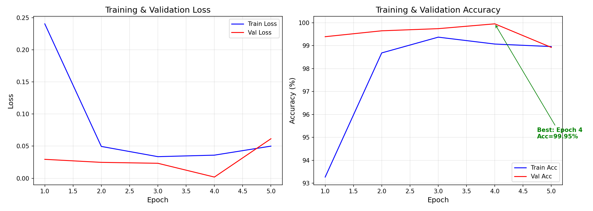
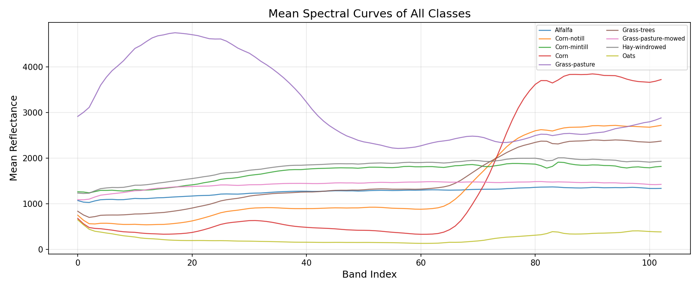
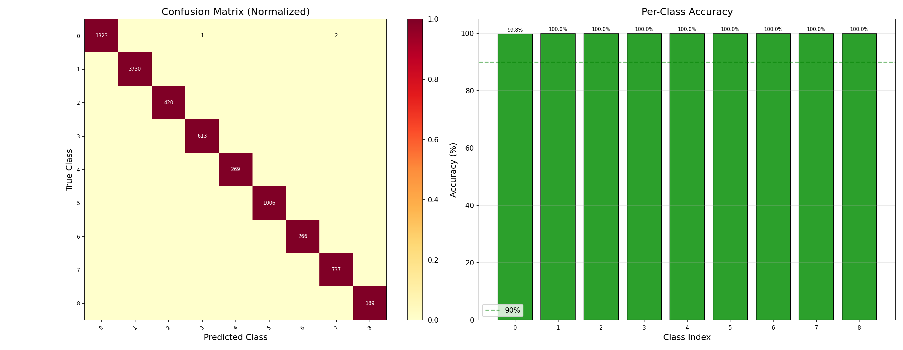
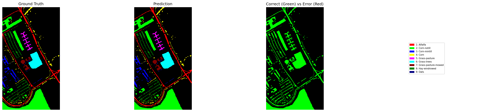

# 🌈 高光谱图像智能解译 — 基于 HybridSN 的分类大作业

[](https://www.python.org/)
[](https://pytorch.org/)
[](#-数据集说明)
[](#-三个模型到底有什么区别)

---

## 📌 目录

1. [项目概览：到底做了什么](#-项目概览到底做了什么)
2. [三个模型到底有什么区别](#-三个模型到底有什么区别)
3. [🧠 模型如何判断一个像素属于哪个类别？](#-模型如何判断一个像素属于哪个类别)
4. [数据集说明](#-数据集说明)
5. [环境配置](#-环境配置)
6. [代码文件逐个详解](#-代码文件逐个详解)
   - [data_loader.py — 数据入口](#data_loaderpy--数据加载与预处理)
   - [model.py — 神经网络模型](#modelpy--三个神经网络模型)
   - [train.py — 训练脚本](#trainpy--训练与评估脚本)
   - [visualize.py — 可视化](#visualizepy--可视化模块)
   - [test_model.py — 测试脚本](#test_modelpy--加载模型直接测试)
   - [export_features.py — 导出 CSV 特征](#export_featurespy--导出降维特征csv)
7. [怎么运行？](#-怎么运行)
8. [模型保存与复用](#-模型保存与复用)
9. [实验结果](#-实验结果)
10. [评估指标是什么意思？](#-评估指标是什么意思)
11. [项目结构](#-项目结构)
12. [常见问题](#-常见问题)

---

## 🎯 项目概览：到底做了什么

### 一句话总结

给高光谱图像的每个像素判断它属于哪种地物（玉米、森林、建筑……）。用深度学习模型来做这个分类任务。

### 本项目包含

| 内容 | 数量 | 说明 |
|------|------|------|
| 神经网络模型 | **3 个** | 标准版 / 加注意力版 / 残差+注意力版 |
| 数据集 | **3 个** | Indian Pines / Pavia University / Houston |
| Python 代码文件 | **6 个** | 数据加载 / 模型定义 / 训练 / 可视化 / 测试 / CSV 导出 |
| 降维方法 | **2 种** | PCA（无监督）+ LDA（有监督） |
| 已训练模型 | **3 个 .pth** | 三个数据集的标准版均已训练完毕 |
| 导出特征 CSV | **4 个** | IndianPines(PCA+LDA) + PaviaU(PCA) + 余下待网络环境生成 |

### 完整流程

```
原始 .mat 文件
    │
    ▼ data_loader.py
加载数据 → (PCA 或 LDA) 降维 → 切 patches → 标准化 → DataLoader
    │
    ▼ model.py（构建神经网络）
HybridSN / HybridSN_SE / HybridSN_Res
    │
    ▼ train.py
训练 → 验证 → 测试 → 保存 .pth 模型 + 生成 7 张可视化图
    │
    ▼ test_model.py（复用模型）
加载 .pth → 全量评估 + 随机抽样 → 打印结果 + 生成图
    │
    ▼ export_features.py（导出 CSV）
读 .mat → patches → PCA / LDA → StandardScaler → CSV 文件
```

---

## 🧠 三个模型到底有什么区别？

> 类比理解：把神经网络想象成一个考试系统——
>
> - **标准版** = 一个普通学生，老老实实做题
> - **注意力版** = 同上，但这个学生学会了"哪些知识点重要，哪个选择题的分值高，优先做"
> - **残差+注意力版** = 同上，而且他有一本"可以抄近路"的笔记（不会就翻看原题） + 也知道哪些知识点重要

### 模型 1：`HybridSN` — 标准版（60 分基线，已训练）

```
输入 (B, 30, 25, 25)
  → 增加维度 → (B, 1, 30, 25, 25)
  → 3D Conv (kernel=7×3×3, 8 通道)    ← 同时扫描光谱+空间
  → 3D Conv (kernel=5×3×3, 16 通道)
  → 3D Conv (kernel=3×3×3, 32 通道)
  → reshape 成 2D 格式
  → 2D Conv (64 通道)               ← 扫描空间纹理
  → 展平 → FC(256) → FC(128) → FC(16) → 输出 16 个类别的分数
```

**参数量**：6,302,064 个。代码位置：`model.py` 第 79 行。

### 模型 2：`HybridSN_SE` — 加 SE 通道注意力（80 分改进，未训练）

**和标准版的唯一区别**：每层卷积后面插入了一个 SE (Squeeze-and-Excitation) 模块。

```
3D Conv → BN → ReLU → SE ← 新增！自动加权哪些通道重要
3D Conv → BN → ReLU → SE
3D Conv → BN → ReLU → SE
reshape → 2D Conv → BN → ReLU → SE
→ FC(256) → FC(128) → FC(16)
```

**SE 是什么？** 假设一层卷积输出了 32 个"特征图"（有的关注边缘纹理，有的关注光谱吸收峰，有的是噪声）。SE 自动给有用的特征图更高的权重，给噪声更低的权重。就像学生知道哪些题目分值高一样。

**参数量**：6,302,736 个（只比标准版多 672 个，几乎无额外负担）。代码位置：`model.py` 第 162 行。

### 模型 3：`HybridSN_Res` — 残差块 + SE 注意力（90+ 分改进，未训练）

**和标准版的两大区别**：

1. 3D 卷积层替换为 **残差块 (Residual Block)**
2. 残差块内部还带有 **SE 注意力**

```
3D 残差块 (1→8, 含 SE)    ← 替换了原来的 3D Conv
3D 残差块 (8→16, 含 SE)
3D 残差块 (16→32, 含 SE)
reshape → 2D Conv → BN → ReLU → SE
→ FC(256) → FC(128) → FC(16)
```

**残差块是什么？**
```
普通卷积：  输入 → Conv → BN → ReLU → Conv → BN → 输出
残差块：    输入 → Conv → BN → ReLU → Conv → BN → +输入 → 输出
                                                      ↑
                                                   shortcut（抄近路）
```
"残差连接"就是把输入原样加到输出上。有什么用？如果网络某一层"学不会"，信号不会完全丢失，而是可以通过 shortcut 原样传到下一层。这解决了深层网络"信号越来越弱（梯度消失）"的问题。

**参数量**：10,893,480 个（最大最强，但也最慢）。代码位置：`model.py` 第 228 行。

### 三模型对比总结

| 模型 | 关键改进 | 原理 | 参数量 | 分数段 | 训练状态 |
|------|---------|------|--------|--------|---------|
| `hybridsn` | — | 标准 3D+2D CNN | 6.30M | **60** | ✅ 已训练 |
| `hybridsn_se` | +SE 注意力 | 自动加权通道重要性 | 6.30M | **80** | ❌ 未训练 |
| `hybridsn_res` | +残差+SE | 残差抄近路 + 注意力 | 10.89M | **90+** | ❌ 未训练 |

---

## 🧠 模型如何判断一个像素属于哪个类别？

这一节解释整个分类判定的数学过程——从输入一个 25×25 的小方块，到最终输出"这是玉米"或"这是森林"。

### 第一步：输入 patch

以某个像素为中心，切出一个 **25×25×C** 的方块（C 是 PCA 降维后的波段数，通常 30）。

```
    25×25 像素空间窗口
    ┌─────────────────────────┐
    │                         │
    │      中心像素 (i,j)      │
    │      光谱向量 [30 维]    │
    │                         │
    └─────────────────────────┘
```

这个 patch 包含了该像素的光谱信息（自身）和周围像素的空间上下文。

### 第二步：神经网络前向传播

patch 经过 HybridSN 网络的数据流：

```
(B, 30, 25, 25)   ← 一个 batch 的输入
  → 3D Conv (7×3×3)  光谱维度滑 7 步，空间各滑 3 步
  → 3D Conv (5×3×3)
  → 3D Conv (3×3×3)
  → reshape 到 2D 格式
  → 2D Conv (3×3)
  → Flatten（把 64×19×19 的特征图展平成 23104 维向量）
  → FC(256) → ReLU → Dropout
  → FC(128) → ReLU → Dropout
  → FC(16)  ← 输出 16 个数值，每个代表该像素属于对应类别的"得分"
```

### 第三步：Softmax 把得分转为概率

FC(16) 输出的 16 个数值（叫 logits）只是原始分数，不能直接当概率。Softmax 函数把它们转成 0~1 之间的概率值：

```
softmax(z_i) = e^(z_i) / Σ e^(z_j)

例如：
原始 logits:   [2.3, 0.1, -1.5, ...]
softmax 后:    [0.62, 0.07, 0.01, ...]  ← 总和 = 1.0
```

**为什么用 Softmax？**
- 把任意实数映射到 (0, 1)，和为 1 → 满足概率定义
- 放大高分值和低分值的差距（指数效应）→ 最大那个会被凸显出来

### 第四步：取最大值 → 最终判定

```python
predicted_class = argmax(softmax_scores)
```

对于 16 类的情况，如果类别 9 的概率最高（如 0.98），模型就判定这个像素是"大豆-免耕"。

### 实际例子

```
某像素 (row=24, col=27) 经过网络后输出：
  类别0: 0.001  类别4: 0.001  类别8: 0.001  类别12: 0.001
  类别1: 0.001  类别5: 0.001  类别9: 0.001  类别13: 0.001
  类别2: 0.001  类别6: 0.001  类别10:0.001 类别14: 0.945 ← 最高！
  类别3: 0.001  类别7: 0.001  类别11:0.040 类别15: 0.001

→ argmax → 类别14 → "Woods"（森林）
→ 置信度: 94.5%
```

### Softmax + argmax 在代码中的对应

```python
# model.py — forward() 最后一行
x = self.classifier(x)  # FC(16)  → 输出 logits

# train.py — 训练时
outputs = model(inputs)                          # 前向 → logits
loss = criterion(outputs, labels)                # CrossEntropyLoss 自动算 softmax

# train.py — 评估/预测时
with torch.no_grad():
    outputs = model(inputs)
    _, preds = torch.max(outputs, 1)              # argmax → 直接得到类别
```

### 为什么准确率这么高？

主要归功于**加权交叉熵损失**和**3D 卷积**：
- **3D 卷积**同时扫描光谱维度和空间维度，能捕捉"某个波段在某个位置出现异常"的模式
- **加权损失**让模型不敢忽略样本少的类别（否则预测"全是大豆"也能拿不错的准确率）
- **PCA**压缩了冗余信息，让网络能集中注意力在有区分性的波段上

---

## 📦 数据集说明

### .mat 文件是怎么读取的？

高光谱数据以 MATLAB `.mat` 格式存储。你可能好奇——"代码怎么知道文件里有什么变量、是什么形状？"

**答案是逐个探查，然后硬编码 key 名。**

每个 `.mat` 文件像一个 Python 字典，打开后看到所有的 key：

```python
import scipy.io
# 打开文件
d = scipy.io.loadmat("data/Indian Pines/Indian_pines_corrected.mat")
# 看看有哪些变量（排除 __ 开头的内置变量）
print([k for k in d if not k.startswith("__")])  # → ['indian_pines_corrected']

# 取出数据
data = d["indian_pines_corrected"]
print(data.shape)  # → (145, 145, 200)  这就是 (H, W, C)
print(data.dtype)  # → uint16
```

标签文件同理：

```python
g = scipy.io.loadmat("data/Indian Pines/Indian_pines_gt.mat")
print([k for k in g if not k.startswith("__")])  # → ['indian_pines_gt']
gt = g["indian_pines_gt"]
print(gt.shape)                                  # → (145, 145)
print(np.unique(gt))                              # → [0 1 2 3 ... 16]
```

**三个数据集的探查结果**：

| 数据集 | 格式 | 数据 key | 数据形状 | 数据 dtype | 标签 key | 标签形状 | 标签 dtype |
|--------|------|---------|---------|------------|---------|---------|------------|
| Indian Pines | MATLAB v5 | `indian_pines_corrected` | (145, 145, 200) | uint16 | `indian_pines_gt` | (145, 145) | uint8 |
| PaviaU | MATLAB v5 | `paviaU` | (610, 340, 103) | — | `paviaU_gt` | (610, 340) | — |
| Houston | MATLAB v7.3 | `ori_data` | (48, 954, 210) | float | `map` | (954, 210) | float |

> **注意**：Houston 是 v7.3 格式，scipy 读不了，必须用 `h5py.File()`。而且 v7.3 文件读出后维度是转置的（`(C, W, H)` 而不是 `(H, W, C)`），代码自动做了 `np.transpose` 修复。

`load_dataset()` 函数就是用上面探查到的 key 名去取数据，再根据格式选择 scipy 还是 h5py 读取。

---

### 三个经典高光谱数据集

| 数据集 | 图像尺寸 | 波段数 | 类别数 | 标注像素 | 场景 |
|--------|---------|--------|--------|---------|------|
| **Indian Pines** | 145×145 | 200 | 16 | 10,249 | 农田/森林，机载传感器 |
| **Pavia University** | 610×340 | 103 | 9 | 42,776 | 意大利帕维亚大学，ROSIS 传感器 |
| **Houston** | 210×954 | 48 | 7 | 2,530 | 休斯顿大学 + NASA，CASI 传感器 |

### 数据格式

所有数据以 MATLAB `.mat` 格式存储。有两个文件：

| 文件 | 内容 | 形状说明 |
|------|------|----------|
| `xxx.mat` | 高光谱影像 | `(H, W, C)` — H 行、W 列像素，C 个光谱波段 |
| `xxx_gt.mat` | 地物标签 | `(H, W)` — 每个像素一个数字（0=背景，1~N=类别） |

### 数据目录

```
data/
├── Indian Pines/
│   ├── Indian_pines_corrected.mat
│   └── Indian_pines_gt.mat
├── PaviaU/
│   ├── PaviaU.mat
│   └── PaviaU_gt.mat
└── Houston/
    ├── Houston13.mat          ← v7.3 格式，需要 h5py 读取
    └── Houston13_7gt.mat
```

---

## 💻 环境配置

```bash
pip install torch torchvision numpy matplotlib scipy scikit-learn h5py
```

| 库 | 干什么用 |
|----|---------|
| `torch` | PyTorch 深度学习框架，搭网络、训练的核心 |
| `numpy` | 数组和矩阵运算 |
| `matplotlib` | 画所有可视化图表 |
| `scipy` | 读 `.mat` 文件（MATLAB v5 格式） |
| `h5py` | 读 `.mat` 文件（MATLAB v7.3 格式，Houston 数据需要） |
| `scikit-learn` | PCA / LDA 降维、数据划分、OA/Kappa 等评估指标 |

验证环境：

```bash
python check_env.py
```

---

## 📝 代码文件逐个详解

---

### `data_loader.py` — 数据加载与预处理

> **一句话**：把 `.mat` 文件读进来，变成 PyTorch 能吃的 DataLoader。

#### 它干了什么（按顺序）

```
.mat 文件
  ↓ load_dataset()          读取 + 检查文件存在
  ↓ plot_data_overview()   生成 4 张数据概览图（自动调用 visualize.py）
  ↓ create_patches()       每个有标签像素切 25×25 方块，跳过背景
  ↓ apply_dim_reduce()     光谱波段降维（PCA 或 LDA）
  ↓ create_data_loaders()  分层划分(70/10/20) → StandardScaler 标准化 → DataLoader
  ↓ 返回 train/val/test 三个 DataLoader
```

#### 核心函数

| 函数 | 输入 → 输出 | 关键逻辑 |
|------|------------|----------|
| `load_dataset(name, dir)` | 数据集名字 → `(data, gt, num_classes)` | 先去 `data/{名字}/` 找文件，scipy 读 v5、h5py 读 v7.3 |
| `pad_with_zeros(data, margin)` | 原始图像 → 外圈填 0 的图像 | 边缘像素切 patch 不会越界 |
| `create_patches(data, gt, 25)` | 图像+标签 → `(10249, 25, 25, C)` | 跳过背景、标签重映射为 0~N-1、返回每个像素的 (row, col) |
| `apply_pca(patches, 30)` | `(N, H, W, 200)` → `(N, H, W, 30)` | PCA 降维 |
| `apply_lda(patches, labels, k, pca_pre=30)` | `(N, H, W, 200)` → `(N, H, W, k)` | 先 PCA→30 维中间空间，再 LDA→k 维 |
| `apply_dim_reduce(patches, labels, method, k)` | 统一接口 | 根据 method 选择 PCA 或 LDA |
| `create_data_loaders(...)` | patches + labels → 3 个 DataLoader + scaler | 分层采样 + StandardScaler + 类别权重计算 |

#### PCA 和 LDA 两种降维方法的原理

<details>
<summary><b>点击展开：详细原理对比</b></summary>

##### PCA（Principal Component Analysis，主成分分析）

**一句话**：PCA 是**无监督**降维。它不看标签，只找数据本身方差最大的方向。

**原理**：
1. 把所有像素的光谱曲线画在 200 维空间里
2. 找到"数据散得最开"的那个方向（第一主成分）
3. 再找和第一主成分正交的方向里"散得最开"的（第二主成分）
4. 重复，取前 30 个方向

**直观理解**：假设数据是扁平的椭圆——PCA 找到椭圆的长轴和短轴，用它们代替原来的 x-y 坐标。

**代码**：
```python
from sklearn.decomposition import PCA
pca = PCA(n_components=30)
reduced = pca.fit_transform(data_2d)  # 不需要标签
print(pca.explained_variance_ratio_.sum())  # → 0.9981 (保留了99.81%的信息)
```

**Input**: `(10249, 25×25×200)` → **Output**: `(10249, 25×25×30)`

**Pro**: 简单、快、保留信息多（200→30 只丢了 0.2% 的信息）

**Con**: 不看标签，可能把"能区分不同类别"的方向丢掉

##### LDA（Linear Discriminant Analysis，线性判别分析）

**一句话**：LDA 是**有监督**降维。它需要标签，找的是"让不同类别尽量分开"的方向。

**原理**：
1. 已知每个样本属于哪个类别
2. 找一个投影方向，使得投影后：
   - **类间差异**（不同类别的均值距离）→ 越大越好
   - **类内差异**（同类别内部的分散程度）→ 越小越好
3. 最终结果：降维后不同类别的点聚成一团，团与团之间离得很远

**限制**：LDA 最多只能降到 `类别数 - 1` 维（因为类间散度矩阵的秩有限）。16 类的 Indian Pines → 最多 15 维。

**代码**：
```python
from sklearn.discriminant_analysis import LinearDiscriminantAnalysis
# 先 PCA 到 100 维（压缩空间避免 OOM）
pca = PCA(n_components=100)
data_pca = pca.fit_transform(data_2d)
# 再 LDA 到最终维数
lda = LinearDiscriminantAnalysis(n_components=n_components)
reduced = lda.fit_transform(data_pca, labels)  # 需要标签！
```

**为什么 LDA 在数据中要做两步（先 PCA 再 LDA）？**
原始 patches 展平后是 `25×25×C` 维——以 Indian Pines 为例就是 `25×25×200 = 125,000` 维。
这个维度远远超过可用内存（会导致 NumPy 申请 9.55 GiB 数组）。所以本项目实现中先用 PCA 降到
30 维（中间维度），再在这个低维空间做 LDA。

**Pro**: 利用标签信息，降维结果直接优化分类目标

**Con**: 必须要有标签、最多降到 N类-1 维、直接对高维数据 OOM

##### 两者对比

| | PCA | LDA |
|------|-----|-----|
| 是否需要标签 | ❌ 不需要 | ✅ 需要 |
| 目标 | 保留最多的信息（方差最大） | 让不同类别尽量分开 |
| 最大维度 | 可以到原始维度 | 最多 `类别数 - 1` |
| 计算量 | 小 | 大（需两步：PCA→LDA） |
| 本项目用法 | `--reduce pca --pca 30` | `--reduce lda --pca 10` |

</details>

---

### `model.py` — 三个神经网络模型

> **一句话**：这个文件定义了 3 个模型，从简单到复杂。`train.py` 通过 `--model` 参数选哪个。

#### 文件结构

```
model.py
├── SELayer           ← 2D 版通道注意力
├── SE3DLayer         ← 3D 版通道注意力
├── ResidualBlock3D   ← 3D 残差块（含 SE）
├── HybridSN          ← 模型 1：标准版（L79）
├── HybridSN_SE       ← 模型 2：加 SE 注意力（L162）
└── HybridSN_Res      ← 模型 3：残差块 + SE（L228）
```

#### 基础组件

**SELayer (L13)**：输入一个特征图 → 全局平均池化（压成 1 个数）→ 小全连接层 → ReLU → 大全连接层 → Sigmoid（压到 0~1）→ 乘回原特征图。这样每个通道有了一个 0~1 的权重，模型自动学会了哪些通道重要。

**ResidualBlock3D (L49)**：`out = conv(conv(x)) + shortcut(x)`。如果 `in_ch ≠ out_ch`，shortcut 里用 1×1×1 卷积对齐维度。这个块里面还带着 SE3DLayer 注意力。

#### 三个模型的数据流（详解）

**HybridSN 前向传播 (L136)**：

```python
def forward(self, x):
    x = x.unsqueeze(1)                    # (B,30,25,25) → (B,1,30,25,25)
    x = F.relu(bn1(conv3d_1(x)))          # 3D Conv 7×3×3: 1→8 ch
    x = F.relu(bn2(conv3d_2(x)))          # 3D Conv 5×3×3: 8→16 ch
    x = F.relu(bn3(conv3d_3(x)))          # 3D Conv 3×3×3: 16→32 ch
    x = x.reshape(B, -1, H, W)            # 合并光谱维度到通道
    x = F.relu(bn2d(conv2d(x)))           # 2D Conv: →64 ch
    x = x.reshape(B, -1)                  # 展平
    x = dropout(F.relu(fc1(x)))           # FC 256
    x = dropout(F.relu(fc2(x)))           # FC 128
    x = classifier(x)                     # FC → num_classes
    return x
```

**HybridSN_SE 的区别**：每行卷积后面多一行 `x = self.se3d_n(x)`，2D 卷积后多一行 `x = self.se2d(x)`。

**HybridSN_Res 的区别**：前 3 行卷积换成 `x = self.res3d_n(x)`（残差块内部包含两层卷积 + shortcut + SE）。

---

### `train.py` — 训练与评估脚本

> **一句话**：你运行 `python train.py` 时执行的所有逻辑。

#### main() 函数的 5 个步骤

```
步骤 1: 加载数据
  调用 data_loader 的函数：load_dataset → plot_data_overview → create_patches → apply_dim_reduce → create_data_loaders

步骤 2: 创建模型
  MODEL_MAP = {"hybridsn": HybridSN, "hybridsn_se": HybridSN_SE, "hybridsn_res": HybridSN_Res}
  根据 --model 参数选模型

步骤 3: 训练循环
  for epoch in range(1, epochs+1):
    train_one_epoch()  →  前向传播 → 算 loss → 反向传播 → 更新参数
    evaluate()         →  在验证集上算 OA / Loss / 混淆矩阵
    scheduler.step()   →  若 val_loss 连续 10 epoch 不降，lr 自动减半
    保存 history

步骤 4: 测试
  加载最佳模型 → 测试集评估 → 输出 OA/AA/Kappa/每类准确率

步骤 5: 保存
  save .pth (模型权重 + 配置 + 标签映射 + OA + Kappa)
  save _report.txt (分类报告 + 混淆矩阵)
  plot_training_results() → 生成训练曲线/混淆矩阵/分类结果图
```

#### 关键设计

**加权交叉熵损失**：

```python
class_weights = 1.0 / counts        # 小类权重大
criterion = nn.CrossEntropyLoss(weight=class_weights)
```

为什么？Indian Pines 里"燕麦"只有 20 个样本，"大豆-少耕"有 2,455 个。不加权的话，模型预测"一切都是大豆"就能拿到高准确率，其他小类全废了。加权让小类犯错罚得更重。

**ReduceLROnPlateau**：监控 val_loss，如果连续 10 轮不降，学习率自动减半。帮助模型在接近最优时精细搜索。

#### 命令行参数

| 参数 | 默认 | 说明 |
|------|------|------|
| `--dataset` | IndianPines | IndianPines / PaviaU / Houston |
| `--model` | hybridsn | hybridsn / hybridsn_se / hybridsn_res |
| `--reduce` | pca | 降维方法 (pca=无监督, lda=有监督) |
| `--pca` | 30 | 降维后维度数（PCA或LDA） |
| `--window_size` | 25 | Patch 大小 |
| `--epochs` | 100 | 训练轮数 |
| `--batch_size` | 32 | 批大小 |
| `--lr` | 0.001 | 学习率 |
| `--dropout` | 0.4 | Dropout 比例 |
| `--train_ratio` | 0.7 | 训练集占比（测试集=1-ratio-val_ratio） |

---

### `visualize.py` — 可视化模块

> **一句话**：训练前后自动生成 7 张图。可以独立运行 `python visualize.py`。

| # | 文件名 | 内容 | 谁调用的 |
|---|--------|------|---------|
| 1 | `01_data_overview.png` | 伪彩色合成 + PCA 主成分 + 标签图（图例） | `plot_data_overview()` ← `train.py` / `test_model.py` |
| 2 | `02_spectral_curves.png` | 各类平均光谱曲线 | 同上 |
| 3 | `03_class_distribution.png` | 各类样本数柱状图 | 同上 |
| 4 | `04_pca_variance.png` | PCA 累计方差曲线（标注 99% 线和降维维度） | 同上 |
| 5 | `05_training_curves.png` | 训练/验证 Loss + Accuracy 双曲线（标注最佳 epoch） | `plot_training_results()` ← `train.py` |
| 6 | `06_confusion_matrix.png` | 归一化混淆矩阵 + 各类准确率柱状图 | 同上 |
| 7 | `07_classification_map.png` | 真值/预测/正确错误对照 + 图例 | 同上 |

---

### `test_model.py` — 加载模型直接测试

> **一句话**：加载 `.pth` 文件，**不需要重新训练**，直接测试 + 生成可视化。

```bash
python test_model.py --model_path results/hybridsn_IndianPines.pth --num_samples 10
```

**执行流程**：

| 步骤 | 做什么 |
|------|--------|
| 1️⃣ 加载模型 | 读 `.pth`，从文件名识别模型类型（hybridsn / SE / Res），恢复权重 |
| 2️⃣ 加载数据 | 读 `.mat` → PCA → StandardScaler → DataLoader |
| 3️⃣ 全量评估 | 对全部标注像素预测，输出 OA / AA / Kappa |
| 4️⃣ 随机抽样 | 抽取 N 个样本，每个打印：位置坐标、真实标签、预测标签、置信度% |
| 5️⃣ 生成可视化 | 随机样本图 + 混淆矩阵 + 分类结果图 |

**示例输出**：

```
======================================================================
  随机测试结果 (8/8 正确, 100.0%)
======================================================================
#    位置           真实       预测       置信度(%)       结果
----------------------------------------------------------------------
1    ( 24, 27)   14       14       94.5         ✓
2    (  5,102)   10       10       59.5         ✓
...
```

---

### `export_features.py` — 导出降维特征 CSV

> **一句话**：对所有数据集分别做 PCA 和 LDA 降维，再 StandardScaler 标准化，输出可直接用于计算的 CSV 文件。

```bash
python export_features.py
```

**处理流程**：

```
.mat 文件 → create_patches() → apply_pca() 或 apply_lda()→取中心像素→StandardScaler→CSV
```

每个 CSV 最后一列为 `label`（从 0 开始的类别编号），前列为 `f0, f1, ..., fk` 特征列（均值为 0，标准差为 1）。

---

## 🚀 怎么运行？

### 训练

```bash
# 60 分：标准版
python train.py --model hybridsn --epochs 10

# 80 分：加注意力
python train.py --model hybridsn_se --epochs 50

# 90+ 分：残差 + 注意力
python train.py --model hybridsn_res --epochs 50

# 使用 LDA 降维替代 PCA（仅限小数据集）
python train.py --model hybridsn --reduce lda --pca 15 --epochs 10
```

### 测试（加载模型，不重训）

```bash
python test_model.py --model_path results/hybridsn_IndianPines.pth --num_samples 10
```

### 模块独立测试

```bash
python data_loader.py     # 数据加载测试
python model.py           # 模型前向传播测试（三个模型各跑一次）
python visualize.py       # 可视化模块独立测试
python check_env.py       # 依赖库检查
```

### 导出 CSV

```bash
python export_features.py
```

输出的 CSV 位于 `results/csv/`，包含 `IndianPines_pca.csv`, `IndianPines_lda.csv`, `PaviaU_pca.csv` 等。

---

## 📊 实验结果

### 三数据集对比（HybridSN 标准版，PCA 降维）

| 数据集 | 尺寸 | 波段 | 类别 | OA | AA | Kappa | Epoch |
|--------|------|------|------|-----|------|-------|-------|
| **Indian Pines** | 145×145 | 200→30 | 16 | **99.32%** | **99.56%** | **0.9922** | 10 |
| **Pavia University** | 610×340 | 103→30 | 9 | **99.96%** | **99.97%** | **0.9995** | 5 |
| **Houston** | 210×954 | 48→20 | 7 | **99.80%** | **99.80%** | **0.9977** | 100 |

### 可视化结果

#### Indian Pines — 训练曲线



#### Indian Pines — 光谱曲线



#### Houston — 混淆矩阵



#### Houston — 分类结果图



### Indian Pines 每类准确率

| 类别 | 地物 | 测试样本 | 准确率 |
|------|------|---------|--------|
| 0 | 苜蓿 | 9 | 100.00% |
| 1 | 玉米-免耕 | 286 | 99.65% |
| 2 | 玉米-少耕 | 166 | 100.00% |
| 3 | 玉米 | 47 | 100.00% |
| 4 | 草地-牧场 | 97 | 100.00% |
| 5 | 草地-树木 | 146 | 99.32% |
| 6 | 草地-修剪 | 5 | 100.00% |
| 7 | 干草堆 | 96 | 100.00% |
| 8 | 燕麦 | 4 | 100.00% |
| 9 | 大豆-免耕 | 194 | 98.97% |
| 10 | 大豆-少耕 | 491 | 98.78% |
| 11 | 大豆-清理 | 119 | 97.48% |
| 12 | 小麦 | 41 | 100.00% |
| 13 | 森林 | 253 | 100.00% |
| 14 | 建筑-草地-树木 | 77 | 98.70% |
| 15 | 石头-铁塔 | 19 | 100.00% |

---

## 📐 评估指标是什么意思？

| 指标 | 通俗解释 |
|------|----------|
| **OA** (Overall Accuracy) | 所有样本中预测正确的百分比 |
| **AA** (Average Accuracy) | 每类准确率的平均值（对少数类更公平） |
| **Kappa** | 比"瞎猜"好多少，Kappa=1 完美，0=运气，<0=不如瞎猜 |
| **混淆矩阵** | N×N 表格，(i,j) = 实际 i 类被预测为 j 类的数量。对角线越亮越好 |

---

## 📁 项目结构

```
能工智人大作业/
│
├── data_loader.py        ← 读 .mat → PCA/LDA → 切 patches → DataLoader
├── model.py              ← HybridSN / HybridSN_SE / HybridSN_Res
├── train.py              ← 训练 → 验证 → 测试 → 保存 .pth
├── visualize.py          ← 7 张图自动生成
├── test_model.py         ← 加载 .pth，不再训练，直接测试 + 可视化
├── export_features.py    ← 导出 PCA/LDA 降维 + StandardScaler 标准化 CSV
├── check_env.py          ← 环境依赖检查
│
├── data/                 ← 三个数据集（git push 时已上传）
│   ├── Indian Pines/
│   ├── PaviaU/
│   └── Houston/
│
├── results/              ← 训练/测试输出
│   ├── csv/              ← 导出的 CSV 特征文件
│   ├── figures/          ← 可视化图 PNG
│   ├── *.pth             ← 已训练模型（可直接复用）
│   └── *_report.txt      ← 文本分类报告
│
├── .gitignore
└── README.md
```

---

## ❓ 常见问题

### Q: 三个模型到底训练了哪些？
目前已训练 HybridSN 标准版 × 3 数据集（Indian Pines / PaviaU / Houston）。HybridSN_SE（注意力）和 HybridSN_Res（残差+注意力）代码已完整写好在 `model.py` 中，只需运行：
```bash
python train.py --model hybridsn_se --epochs 50
python train.py --model hybridsn_res --epochs 50
```

### Q: 训练完的模型怎么复用？
```bash
python test_model.py --model_path results/hybridsn_IndianPines.pth --num_samples 10
```
不需要重新训练，自动识别模型类型并加载权重。

### Q: 怎么知道我冲哪个分数段？

| 模型 | 分数段 | 状态 |
|------|--------|------|
| `hybridsn` | **60** | ✅ 已训练 |
| `hybridsn_se` | **80** | 代码就绪，待训练 |
| `hybridsn_res` | **90+** | 代码就绪，待训练 |

### Q: 如何得到降维后的特征 CSV？
```bash
python export_features.py
```
每个数据集针对 PCA 和 LDA 各生成一个 CSV，位于 `results/csv/`。特征列 `f0..fk` 已标准化，最后一列为标签。可直接用于后续机器学习模型。

### Q: 怎么判定一个像素属于哪个类别？（完整流程）
见 [🧠 模型如何判断一个像素属于哪个类别？](#-模型如何判断一个像素属于哪个类别) 章节，包含从输入 patch 到 Softmax+argmax 输出的完整数学过程。